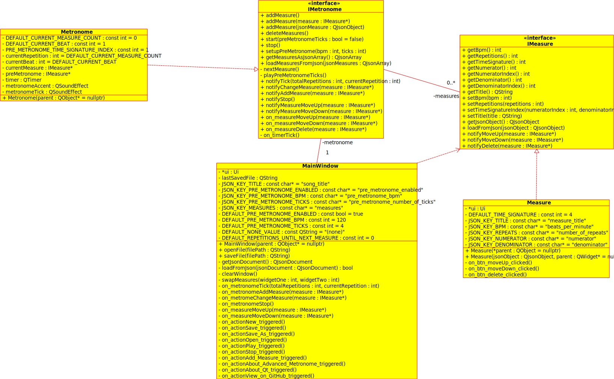
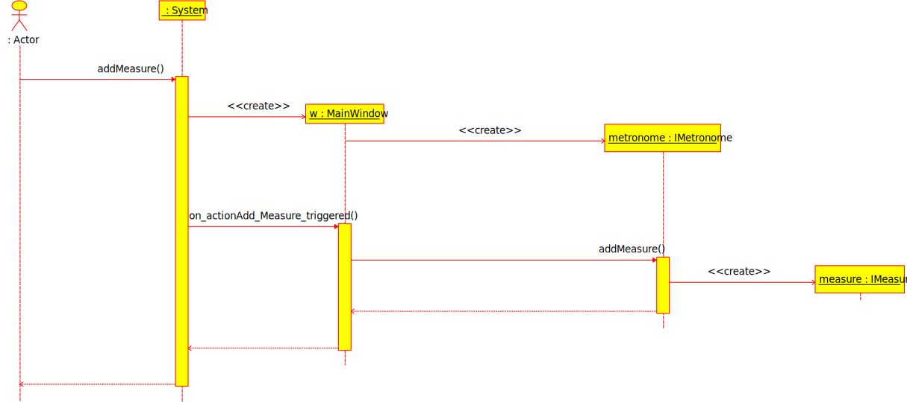
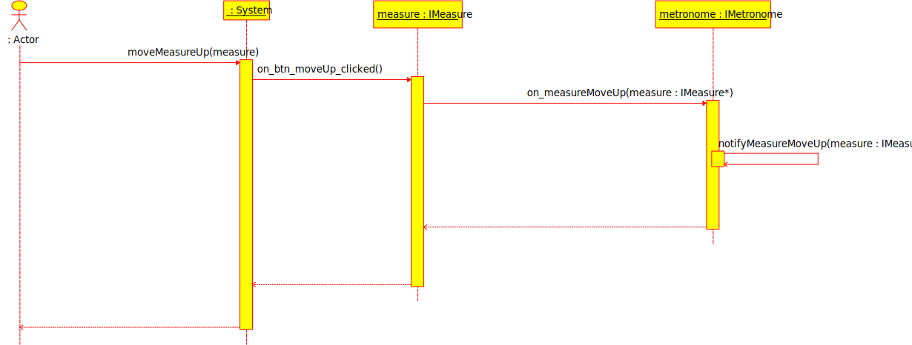
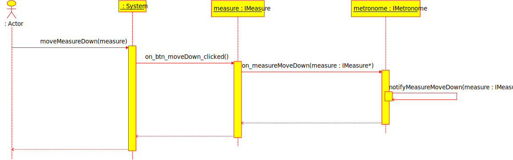
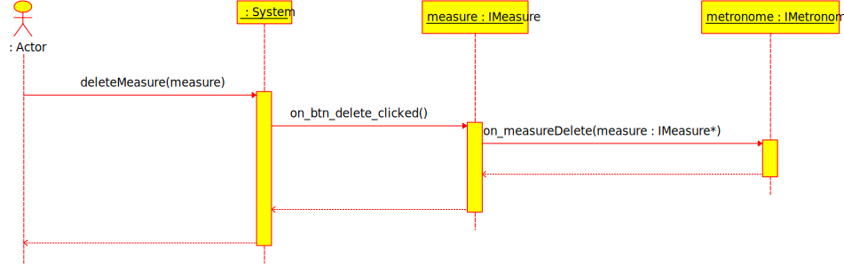
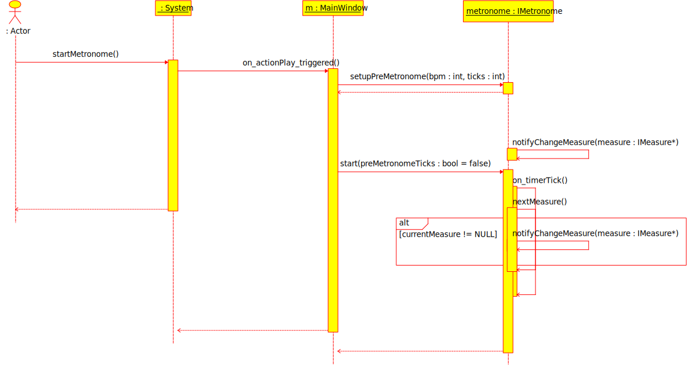
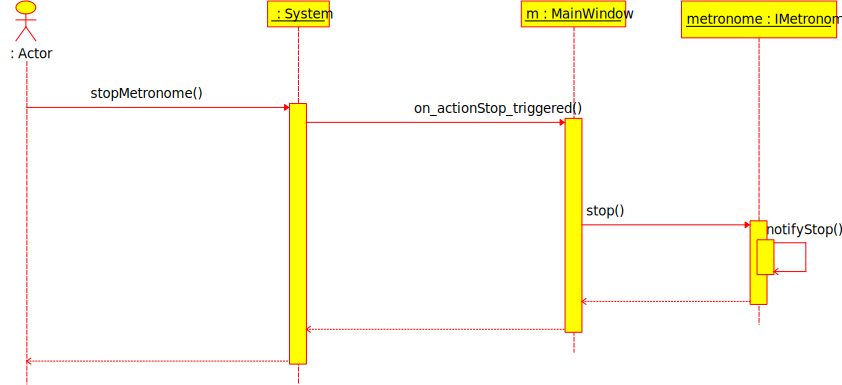
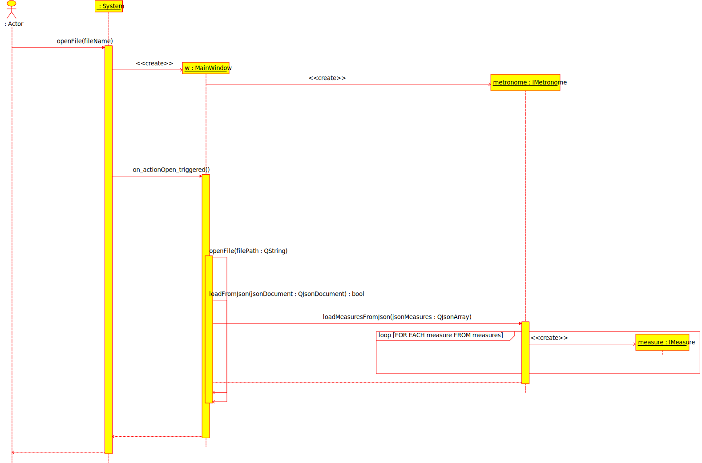
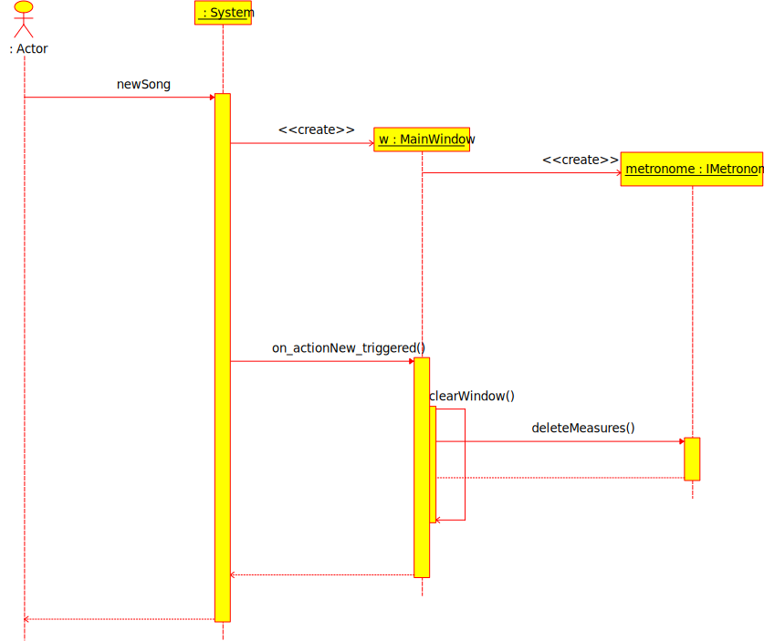

# Software Design Description

__Advanced Metronome__

---

## Version Control

|Name|Date|Version|Edits|
|:---|:---|:---|:---|
|Bart Kessels|26 sept 2018|0.1|First Draft|
|Bart Kessels|27 sept 2018|0.2|Fix incorrect title in TOC; Add sequence diagrams|

## Table of Contents

- [1. Introduction](#1-introduction)
    - [1.1 Description](#11-description)
    - [1.2 Goal of this Document](#12-goal-of-this-document)
    - [1.3 Definitions, Acronyms and Abbreviations](#13-definitions-acronyms-and-abbreviations)
- [2. Detailed Design Description](#2-detailed-design-description)
    - [2.1 Design Advanced Metronome](#21-design-advanced-metronome)
        - [2.1.1 Class Diagram](#211-class-diagram)
        - [2.1.2 Sequence Diagram](#212-sequence-diagram)
	        + [2.1.2.1 UC01 - Add measure](#2121-uc01---add-measure)
	        + [2.1.2.2 UC02 - Move measure up](#2122-uc02---move-measure-up)
	        + [2.1.2.3 UC03 - Move measure down](#2123-uc03---move-measure-down)
	        + [2.1.2.4 UC04 - Delete measure](#2124-uc04---delete-measure)
	        + [2.1.2.5 UC05 - Start metronome](#2125---uc05-start-metronome)
	        + [2.1.2.6 UC06 - Stop metronome](#2126---uc06-stop-metronome)
	        + [2.1.2.7 UC07 - Save file](#2127-uc07---save-file)
	        + [2.1.2.8 UC08 - Open file](#2128-uc08---open-file)
	        + [2.1.2.9 UC09 - New song](#2129-uc09---new-song)
        - [2.1.3 Design Decisions](#213-design-decisions)
- [3. Sources](#3-sources)

## 1. Introduction

### 1.1 Description

The goal of this application is providing bands, and musicians for that matter, with an easy to use and adjustable metronome. Advanced Metronome aims to provide the niche that other metronomes don't support by letting the user decide on a per-measure basis what the tempo should be and in what time signature the measure should be in contrary to only allowing this on song level.

Thus making this application an all-round metronome for the 'easy'1 songs, which have a constant BPM and time signature, and the 'non-easy'1 songs, which have multiple BPM's and time signatures in the song.

> 1: This applies to the implementation of the metronome, not the song itself.

### 1.2 Goal of this Document

This document will provide the technical designs and decisions made during and before the development of Advanced Metronome. Chapter 2 will discuss the design of the application in detail and will describe the various design decisions.

### 1.3 Definitions, Acronyms and Abbreviations

This paragraph will describe all the definitions, acronyms and abbreviations. The definitions can be found in table 1.3.1.

|Term|Description|
|---:|:---|
|_UML_|Unified Modeling Language; Used to create high-level technical diagrams for software development (UML.org, 2005).|

_Table 1.3.1: Definitions, acronyms and abbreviations_

 

## 2. Detailed Design Description

This chapter the technical decisions will be discussed and all the choices will be shown in UML diagrams.

### 2.1 Design Advanced Metronome

#### 2.1.1 Class Diagram

In this paragraph the class diagram for Advanced Metronome is modeled. The design decisions related to the class diagram can be found in paragraph 2.1.3. The class diagram itself can be found in figure 2.1.1.1, the relationships and dependencies between the several classes can be found in table 2.1.1.1 and table 2.1.1.2.

__IMetronome__ 
The `IMetronome` interface provides methods that the other objects need to use
to perform the various metronome-specific functions.

The interface also specifies which signals and slots the implementations must register.

 

__IMeasure__ 
The `IMeasure` interface provides methods that the other objects need to use
to perform the various measure-specific functions.

The interface also specifies which signals and slots the implementations must register.

 

__Metronome__ 
The `Metronome` class is an implementation of the `IMetronome` interface and is responsible for managing the various `IMeasure` implementation objects and makes sure that the `IMeasure` implementation objects are being correctly played while the metronome is playing. The iterating through the `IMeasure` implementation objects is an obligation of the `Metronome` class.

 

__Measure__ 
The `Measure` class is an implementation of the the `IMeasure` interface and is responsible for keeping track of the various fields that can be set by the user for a measure. The `Measure` class also extends from `QWidget` and has an UI (`src/ui/measure.ui`) to it which stores the actual values for the measure.

 

__MainWindow__ 
The `MainWindow` class derives from `QMainWindow` and is the main entry point of the application. This class is responsible for handling all the user input and delegate it to the correct classes. The `MainWindow` class has a couple of methods that are called from within the class but most methods are slots that are being called by either the `IMetronome` implementation object or by the user through the UI.

 
_Figure 2.1.1.1: Class diagram Advanced Metronome_

 

|Relationship number|Between|Type|Description|
|---:|:---:|:---:|:---|
|_AMRL01_|`IMetronome` > `IMeasure`|one-to-many|An `IMetronome` implementation has a list of multiple `IMetronome` implementation objects|
|_AMRL02_|`MainWindow` > `IMetronome`|one-to-one|A `MainWindow` has `IMetronome` implementation object|

_Table 2.1.1.1: Relations class diagram Advanced Metronome_

 

|Dependency number|Between|Description|
|---:|:---:|:---|
|_AMDP01_|`MainWindow` > `IMeasure`|The dependency between the `MainWindow` and `IMeasure` gives `MainWindow` the ability to receive implementations of the `IMeasure` interface in the various slots that are connected to the `IMetronome` object (AMRL02)|

_Table 2.1.1.2: Dependencies class diagram Advanced Metronome_

 

#### 2.1.2 Sequence Diagram

This paragraph contains the various sequence diagrams grouped by the use cases specified in the [Software Requirements Specification](SRS.md). In the sequence diagrams only the method calls to the methods from the class diagram are modeled; the actual implementation of the methods is up to the developer of the sequence diagram.

##### 2.1.2.1 UC01 - Add measure

_Figure 2.1.2.1.1: Sequence Diagram for UC01 - Add measure_

##### 2.1.2.2 UC02 - Move measure up

_Figure 2.1.2.2.1: Sequence Diagram for UC02 - Move measure up_

##### 2.1.2.3 UC03 - Move measure down

_Figure 2.1.2.3.1: Sequence Diagram for UC03 - Move measure down_

##### 2.1.2.4 UC04 - Delete measure

_Figure 2.1.2.4.1: Sequence Diagram for UC04 - Delete measure_

##### 2.1.2.5 UC05 - Start metronome

_Figure 2.1.2.5.1: Sequence Diagram for UC05 - Start metronome_

##### 2.1.2.6 UC06 - Stop metronome

_Figure 2.1.2.6.1: Sequence Diagram for UC06 - Stop metronome_

##### 2.1.2.7 UC07 - Save file

_Figure 2.1.2.7.1: Sequence Diagram for UC07 - Save file_

##### 2.1.2.8 UC08 - Open file

_Figure 2.1.2.8.1: Sequence Diagram for UC08 - Open file_

##### 2.1.2.9 UC09 - New song

_Figure 2.1.2.9.1: Sequence Diagram for UC09 - New song_

#### 2.1.3 Design Decisions

__Signals and Slots__ 
The slots and signals must be prefixed with `on_` for the slot and `notify` for the signal. This way there is a good distinction between the regular methods and the signals/slots.

 

__Slots naming convention__ 
The slot must have a similar name as the signal it's listening for. This way it'll be a lot more straight-forward when connecting slots to signals which slot and signal should be connected.

 

#### 2.1.3.1 Patterns

__Observer Pattern__ 
This one is pretty obvious since the Qt framework is based on this pattern using signals and slots.

 

__Strategy Pattern__ 
The strategory pattern (or inversion of control) is used by the domain classes, so every class except the MainWindow, so the domain classes can operate without knowing the exact implementation of the other domain classes. They do know which methods they can call 'cause of the interfaces.

## 3. Sources

UML.org. (July 2005). _What is UML_. Consulted on September 2018, from [http://www.uml.org/what-is-uml.htm](http://www.uml.org/what-is-uml.htm)
