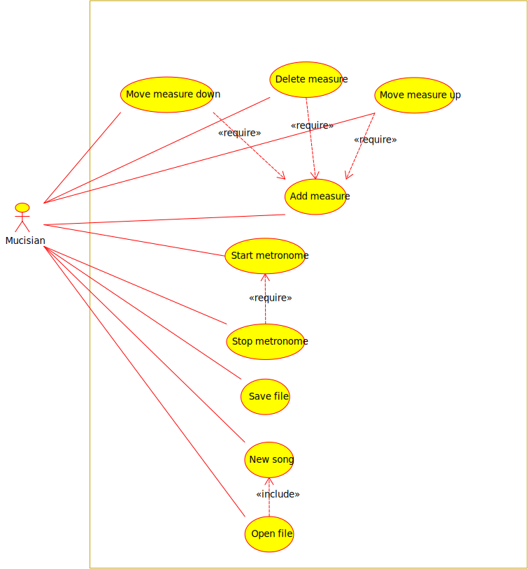
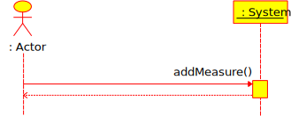
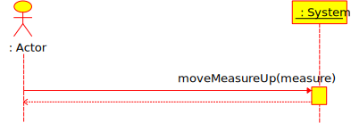
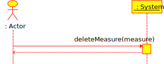
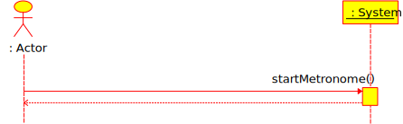
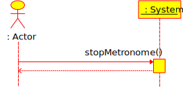
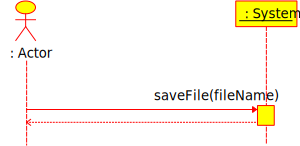
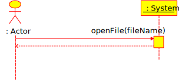
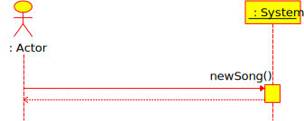

# Software Requirements Specification

__Advanced Metronome__

---

## Version Control

|Name|Date|Version|Edits|
|:---|:---|:---|:---|
|Bart Kessels|27 sept 2018|0.1|First Draft|

## Table of Contents

- [1. Introduction](#1-introduction)
	+ [1.1 Overall Description](#11-overall-description)
	+ [1.2 User Classes and Characteristics](#12-user-classes-and-characteristics)
	+ [1.3 Operating Environment](#12-operating-environment)
	+ [1.4 Design and Implementation Constraints](#14-design-and-implementation-constraints)
	+ [1.5 Product Functions](#15-product-functions)
- [2. Use-case Descriptions](#3-use---case-descriptions)
	+ [2.1 UC01 - Add measure](#31-uc01---add-measure)
		* [2.1.1 Fully-dressed Use-case Description](#211-fully---dressed-use---case-description)
		* [2.1.2 System Sequence Diagram](#212-system-sequence-diagram)
	+ [2.2 UC02 - Move measure up](#32-uc02---move-measure-up)
		* [2.2.1 Fully-dressed Use-case Description](#221-fully---dressed-use---case-description)
		* [2.2.2 System Sequence Diagram](#222-system-sequence-diagram)
	+ [2.3 UC03 - Move measure down](#33-uc03---move-measure-down)
		* [2.3.1 Fully-dressed Use-case Description](#231-fully---dressed-use---case-description)
		* [2.3.2 System Sequence Diagram](#232-system-sequence-diagram)
	+ [2.4 UC04 - Delete measure](#34-uc04---delete-measure)
		* [2.4.1 Fully-dressed Use-case Description](#241-fully---dressed-use---case-description)
		* [2.4.2 System Sequence Diagram](#242-system-sequence-diagram)
	+ [2.5 UC05 - Start metronome](#35-uc05---start-metronome)
		* [2.5.1 Fully-dressed Use-case Description](#251-fully---dressed-use---case-description)
		* [2.5.2 System Sequence Diagram](#252-system-sequence-diagram)
	+ [2.6 UC06 - Stop metronome](#36-uc06---stop-metronome)
		* [2.6.1 Fully-dressed Use-case Description](#261-fully---dressed-use---case-description)
		* [2.6.2 System Sequence Diagram](#262-system-sequence-diagram)
	+ [2.7 UC07 - Save file](#37-uc07---save-file)
		* [2.7.1 Fully-dressed Use-case Description](#271-fully---dressed-use---case-description)
		* [2.7.2 System Sequence Diagram](#272-system-sequence-diagram)
	+ [2.8 UC08 - Open file](#38-uc08---open-file)
		* [2.8.1 Fully-dressed Use-case Description](#281-fully---dressed-use---case-description)
		* [2.8.2 System Sequence Diagram](#282-system-sequence-diagram)
	+ [2.9 UC09 - New song](#39-uc09---new-song)
		* [2.9.1 Fully-dressed Use-case Description](#291-fully---dressed-use---case-description)
		* [2.9.2 System Sequence Diagram](#292-system-sequence-diagram)
	
## 1. Introduction

### 1.1 Overall Description

The goal of this application is providing bands, and musicians for that matter, with an easy to use and adjustable metronome. Advanced Metronome aims to provide the niche that other metronomes don't support by letting the user decide on a per-measure basis what the tempo should be and in what time signature the measure should be in contrary to only allowing this on song level.

Thus making this application an all-round metronome for the 'easy'1 songs, which have a constant BPM and time signature, and the 'non-easy'1 songs, which have multiple BPM's and time signatures in the song.

> 1: This applies to the implementation of the metronome, not the song itself.

### 1.2 User Classes and Characteristics

This paragraph will layout the users that will use the system and what functions they can perform by using the application.

__Musician__ : Create a new song with the various measures and play, save share the metronome.

### 1.3 Operating Environment

Advanced Metronome is supposed to run on all major desktop operating systems, Linux; MacOS and Windows, by using the [Qt](https://qt.io) framework. To be able to compile, and/or run, Advanced Metronome the required Qt packages should be present on the host system. To make the compiling on all major platforms an easy experience only built-in Qt functions and libraries will be used.

### 1.4 Design and Implementation Constraints

Because Advanced Metronome is suppose to run on all major desktop platforms no platform-specific modules, be it third-party or C++-built-in, are supposed be merged into the code-base. 

### 1.5 Product Functions

This paragraph will provide a small, global, overview of the functions that are supported by Advanced Metronome and which actor can invoke specific actions. The use-cases are briefly described in table 1.5.1 and an use-case diagram can be seen in figure 1.5.1.

_Figure 1.5.1: Use-case Diagram_

 

|Use-case number|Use-case name|Brief Description|
|---:|:---|:---|:---|
|UC01|Add measure|The actor can add a measure to a song|
|UC02|Move measure up|The actor can move a measure one place up in the measures list|
|UC03|Move measure down|The actor can move a measure one place down in the measures list|
|UC04|Delete measure|The actor can delete a measure from the measures list|
|UC05|Start metronome|The actor can start the metronome|
|UC06|Stop metronome|The actor can stop the metronome|
|UC07|Save file|The actor can save the metronome song to a file|
|UC08|Open file|The actor can load a metronome song from a file|
|UC09|New song|The actor can load a new song; the old song contents are removed|

_Table 1.5.1: Brief Descriptions Use-cases_

 

## 2. Use-case Descriptions
### 2.1 UC01 - Add measure
#### 2.1.1 Fully-dressed Use-case Description

- __Primary Actor__: Musician
- __Stakeholders and Interests__:
	+ [None]
- __Brief Description__
	+ Before the actor can play a metronome a measure must be added to the measures list
- __Pre-conditions__:
	+ [None]
- __Post conditions__:
	+ A new measure is added to the measures list in the metronome
	+ A new measure is displayed on the screen

 

|Main Success Scenario||
|:---|:---|
|___Actor Action___|___System Responsibility___|
|1. Add a measure to the measures||
||2. Add measure to the metronome measures list|
||3. Display the new measure on the screen|
|__Extensions (Alternative Flow):__||
|-|-|

#### 2.1.2 System Sequence Diagram

_Figure 2.1.2.1: System Sequence Diagram for UC01 - Add measure_

### 2.2 UC02 - Move measure up
#### 2.2.1 Fully-dressed Use-case Description

- __Primary Actor__: Musician
- __Stakeholders and Interests__:
	+ [None]
- __Brief Description__:
	+ If the actor has many measures in the measures list the actor has the ability to move a measure one position up the list
- __Pre-conditions__:
	+ There are more than one measures
	+ The measure that is being moved up isn't at the top of the list
- __Post-conditions__:
	+ The measure is moved one place up the metronome measures list
	+ The measure is moved on place up in the window
	
 

|Main Success Scenario||
|:---|:---|
|___Actor Action___|___System Responsibility___|
|1. Move measure one place up||
||2. Move measure one place up in the metronome measures list|
||3. Move measure one place up on the screen|
|__Extensions (Alternative Flow):__||
|-|-|

#### 2.2.2 System Sequence Diagram

_Figure 2.2.2.1: System Sequence Diagram for UC02 - Move measure up_

### 2.3 UC03 - Move measure down
#### 2.3.1 Fully-dressed Use-case Description

- __Primary Actor__: Musician
- __Stakeholders and Interests__:
	+ [None]
- __Brief Description__:
	+ If the actor has multiple measures in the measures list the actor has the ability to move a measure one position down in the list
- __Pre-conditions__:
	+ There are more than one measures
	+ The measure that is being moved down isn't at the bottom of the list
- __Post-conditions__:
	+ The measure is moved one place down the metronome measures list
	+ The measure is moved one place down in the window
	
 

|Main Success Scenario||
|:---|:---|
|___Actor Action___|___System Responsibility___|
|1. Move measure one place down||
||2. Move measure one place down in the metronome measures list|
||3. Move measure one place down on the screen|
|__Extension (Alternative Flow):__||
|-|-|

#### 2.3.2 System Sequence Diagram

_Figure 2.3.2.1: System Sequence Diagram for UC03 - Move measure down_

### 2.4 UC04 - Delete measure
#### 2.4.1 Fully-dressed Use-case Description

- __Primary Actor__: Musician
- __Stakeholders and Interests__:
	+ [None]
- __Brief Description__:
	+ If the actor has one or more measures in the measures list the actor can delete a measure from the measures list
- __Pre-conditions__:
	+ There is at least one measure
- __Post-conditions__:
	+ One measure is deleted from the metronome measures list
	+ One measure is deleted from the window

 

|Main Success Scenario||
|:---|:---|
|___Actor Action___|___System Responsibility___|
|1. Delete measure||
||2. Remove measure from metronome measures list|
||3. Remove measure from the window|
|__Extension (Alternative Flow):__||
|-|-|

#### 2.4.1 System Sequence Diagram

_Figure 2.4.1.1: System Sequence Diagram for UC04 - Delete measure_

### 2.5 UC05 - Start metronome
#### 2.5.1 Fully-dressed Use-case Description

- __Primary Actor__: Musician
- __Stakeholders and Interests__:
	+ [None]
- __Brief Description__:
	+ If the actor has setup all the measures the actor can start the metronome
- __Pre-conditions__:
	+ There are one or more measures added
- __Post-conditions__:
	+ The metronome is playing the measures
	
 

|Main Success Scenario||
|:---|:---|
|___Actor Action___|___System Responsibility___|
|1. Start metronome||
||2. Play first measure in measures list|
||3. Update UI to display current measure title and repetitions left|
||4. [Go back to step 2 until there are no more measures in the list]|
||5. Stop the metronome|
||6. Update UI to display default values for measure title and repetitions left|
|__Extensions (Alternative Flow):__||
|-|-|

#### 2.5.2 System Sequence Diagram

_Figure 2.5.2.1: System Sequence Diagram for UC05 - Start metronome_

### 2.6 UC06 - Stop metronome
#### 2.6.1 Fully-dressed Use-case Description

- __Primary Actor__: Musician
- __Stakeholders and Interests__:
	+ [None]
- __Brief Description__:  
	+ Once the metronome is playing the actor can stop the metronome
- __Pre-conditions__:
	+ The metronome is playing
- __Post-conditions__:
	+ The metronome isn't playing anymore
	
 

|Main Success Scenario||
|:---|:---|
|___Actor Action___|___System Responsibility___|
|1. Stop metronome||
||2. Stop metronome|
||3. Update UI to show default values for measure title and repetitions left|
|__Extensions (Alternative Flow):__||
|-|-|

#### 2.6.2 System Sequence Diagram

_Figure 2.6.2.1: System Sequence Diagram for UC06 - Stop metronome_

### 2.7 UC07 - Save file
#### 2.7.1 Fully-dressed Use-case Description

- __Primary Actor__: Musician
- __Stakeholders and Interests__:
	+ [None]
- __Brief Description__:
	+ The actor can save a metronome to a file
- __Pre-conditions__:
	+ [None]
- __Post-conditions__:
	+ The values of the metronome are saved to a, by the actor, specified file
	
 

|Main Success Scenario||
|:---|:---|
|___Actor Action___|___System Responsibility___|
|1. Save file||
||2. Check if a file is already saved|
||_[File is not already saved]_|
||3. Prompt actor to select a file|
|4. Select a file||
||5. Save the metronome to the file|
|__Extensions (Alternative Flow):__||
||[File is already saved]|
||Go to step 5|
|||
|_[Cancels selection]_||
||4a. Stops saving of the file|
||4b. Return to default application state|
|||
||_[File already exists]_|
||5a. Ask actor to overwrite file|
|5b. Agrees to overwrite file||
||5c. Save the file|

#### 2.7.2 System Sequence Diagram

_Figure 2.7.2.1: System Sequence Diagram for UC07 - Save file_

### 2.8 UC08 - Open file
#### 2.8.1 Fully-dressed Use-case Description

- __Primary Actor__: Musician
- __Stakeholders and Interests__:
	+ [None]
- __Brief Description__:
	+ The actor can open a metronome from a file
- __Pre-conditions__:
	+ [None]
- __Post-conditions__:
	+ The values of the file are displayed in the UI
	
 

|Main Success Scenario||
|:---|:---|
|___Actor Action___|___System Responsibility___|
|1. Open file||
||2. Display open file dialog|
|3. Select file||
||4. Check if file is a valid JSON file|
||_[File is valid JSON]_|
||5. Parse the JSON and show in the UI|
|__Extensions (Alternative Flow):__||
|_[Cancels selection]_||
||3a. Return to default application state|
|||
||_[File isn't valid JSON]_|
||4a. Display error dialog|
||4b. Return to default application state|
|||
||_[File doesn't contain correct JSON for application]_|
||5a. Stop parsing JSON|
||5b. Return to default application state|

#### System Sequence Diagram

_Figure 2.8.2.1: System Sequence Diagram for UC08 - Open file_

### 2.9 UC09 - New song
#### 2.9.1 Fully-dressed Use-case Description

- __Primary Actor__: Musician
- __Stakeholders and Interests__:
	+ [None]
- __Brief Description__:
	+ The actor can clear the UI and metronome by starting a new song
- __Pre-conditions__:
	+ [None]
- __Post-conditions__:
	+ The application state has been reset to it's default state
	
 

|Main Success Scenario||
|:---|:---|
|___Actor Actions___|___System Responsibility___|
|1. Start new song||
||[If a song is loaded from a file]|
||2. Ask if actor wants to clear the current song|
|3. Allow clearing the song||
||4. Return to default application state|
|__Extensions (Alternative Flow):__||
|[User cancels creation of new song]||
||3a. Return to default application state|

#### 2.9.2 System Sequence Diagram

_Figure 2.9.2.1: System Sequence Diagram for UC09 - New song_