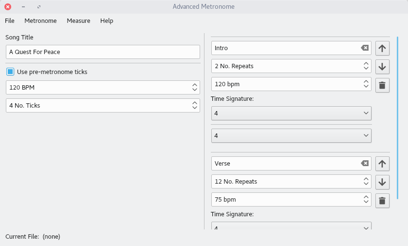

# Advanced Metronome

Advanced Metronome is a small application in which you can set multiple measures with their own speed, time-signature and number of repeats.
This gives you the ability to practice songs that have multiple speeds and/or time-signatures.

---

## Table of Contents

- [1. Screenshots](#1-screenshots)
- [2. What can I do with It?](#2-what-can-i-do-with-it)
- [3. Documentation](#3-documentation)
- [4. Required Packages](#4-required-packages)
	+ [4.1 Building](#41-building)
	+ [4.2 Installing](#42-installing)
- [5. How to Build](#5-how-to-build)
	+ [5.1 Linux](#51-linux)
	+ [5.2 Windows](#52-windows)
- [6. Packaging](#6-packaging)
	+ [6.1 RPM package](#61-rpm-package)
	+ [6.2 Flatpak bundle](#62-flatpak-bundle)
- [7. Pre-built binaries](#7-pre---built-binaries)
	+ [7.1 RPM from CORP](#71-rpm-from-copr)

## 1. Screenshots



## 2. What can I do with it?

Advanced Metronome is created for musicians who want to practice songs which have multiple
speeds and/or time-durations. 'Cause regular metronomes only allow one constant tempo Advanced Metronome
steps in to solve this problem.

Advanced Metronome also gives you the ability to save and share your songs with others so this application will
suit many bands in their song-writing process.

## 3. Documentation

All the available documentation for Advanced Metronome can be found in the [docs folder](docs). The UML diagrams are modeled using [Umbrello](https://umbrello.kde.org) a cross-platform application for UML-modeling. There are also SVG-images available for these diagrams in case you don't want to install Umbrello at [docs/diagrams/svg](docs/diagrams/svg).

- [Software Requirements Specification](docs/SRS.md)
- [Software Design Description](docs/SDD.md)

## 4. Required packages

### 4.1 Building

- qt5-devel
- qt5-qtbase-devel
- qt5-qtmultimedia-devel

### 4.2 Installing

- qt5
- qt5-multimedia

## 5. How to build

### 5.1 Linux

```
$ qmake
$ make install
```

And then run `advancedmetronome`

### 5.2 Windows

This method assumes you're using the [Mingw32](http://www.mingw.org/) executables that can be installed
along with [Qt](https://www.qt.io/download) itself.

```
> qmake -config release
> mingw32-make
> windeployqt bin/advancedmetronome.exe
```
This will create a binary `advancedmetronome.exe` in the `bin/` folder with all the required Qt DLL's,
to run the application you simply run `start bin/advancedmetronome.exe`.

## 6. Packaging

### 6.1 RPM package

```
$ cd data/packaging/RPM
$ spectool -g advancedmetronome.spec
$ fedpkg --release f28 local
```

This will create a RPM file which you can install using your package manager.

### 6.2 Flatpak bundle

```
$ cd data/packaging/flatpak
$ flatpak-builder --repo=advancedmetronome_repo advancedmetronome net.bartkessels.advancedmetronome.json
$ flatpak build-bundle advancedmetronome_repo advancedmetronome.flatpak net.bartkessels.advancedmetronome
```

This will create a flatpak bundle called `advancedmetronome.flatpak`. To install the flatpak bundle
just run the command

```
$ flatpak install advancedmetronome.flatpak
```

Once installed you can run it from flatpak like this

```
$ flatpak run net.bartkessels.advancedmetronome
```

## 7. Pre-built binaries

### 7.1 RPM from COPR

If you're running Fedora you can easily install Advanced Metronome from [COPR](https://copr.fedorainfracloud.org/coprs/bartkessels/advancedmetronome/).

```
$ dnf copr enable bartkessels/advancedmetronome
$ dnf install advancedmetronome
```
